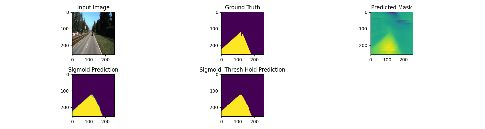
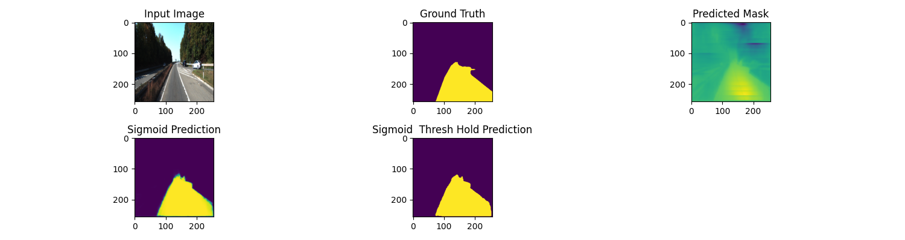

# 🛣️ Road Surface Segmentation with U-Net (PyTorch + CUDA)

This project performs **semantic segmentation of road surfaces** from camera images using a custom-built **U-Net architecture** implemented in **PyTorch**. It is designed for educational and experimental purposes in computer vision and autonomous driving systems.

---

## 📌 Features

- ✅ Custom U-Net implementation in PyTorch
- ✅ Supports GPU acceleration with CUDA
- ✅ Binary road segmentation (road vs non-road)
- ✅ Evaluation with **IoU** and **Dice Score**
- ✅ TensorBoard support for training visualization
- ✅ KITTI Road Dataset compatibility

---

## 🧠 U-Net Architecture

U-Net is a **fully convolutional neural network** designed for image segmentation. It consists of:

- **Encoder (contracting path):** captures semantic context using convolution and pooling
- **Decoder (expanding path):** enables precise localization using transposed convolutions
- **Skip connections:** bridge encoder and decoder layers to preserve spatial information

In this project:
- Input: RGB image (3 channels)
- Output: Binary mask (1 channel)
- Loss: `BCEWithLogitsLoss` (optionally Dice Loss)
- Optimizer: `Adam`
- Image size: 256x256 (resized)

---

## 📂 Dataset

This project uses the **KITTI Road Benchmark Dataset**.

> Due to file size limits, the dataset is **not included** in this repository.

### 🔗 [Download Dataset](https://www.cvlibs.net/datasets/kitti/eval_road.php)
> Download the base kit


## 🚀 Getting Started

### 1. Clone the repository
```bash
git clone https://github.com/satilmiskabasakal/road-segmentation-unet.git
cd road-segmentation-unet
```
### 2. Install dependencies
```bash
pip install -r requirements.txt
```
### 3. Train the model
```bash
python train.py
```

### 4. Run prediction on a sample
```bash
python predict.py
```

### 📊 Evaluation Metrics
 IoU (Intersection over Union)
 Dice Score

Used to measure segmentation accuracy on binary masks.

### 📈 TensorBoard
```bash
tensorboard --logdir=runs
```
Visualizes:

Training loss over epochs

Predicted masks vs ground truth


### 🧪 Example Results



### 📁 Project Structure
```
road_segmentation_project/
├── data_road/
│   ├── training/
│   │   ├── image_2/
│   │   └── gt_image_2/
│   │
│   └── testing/
│       └── image_2/
├── models/
│   └── unet.py              # U-Net model implementation
├── dataset.py               # Custom dataset class
├── train.py                 # Training script
├── predict.py               # Inference and visualization
├── runs/                    # TensorBoard logs
├── requirements.txt
└── README.md
```

### 🙋‍♂️ Author
Satılmış Kabasakal – @satilmiskabasakal0
